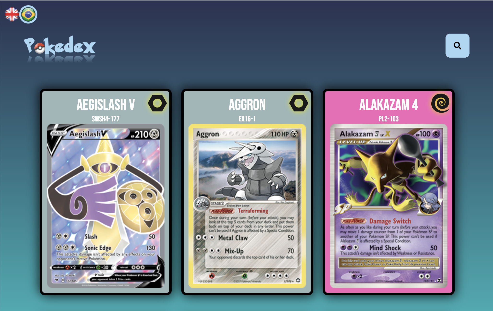

# Pokedex

This pokedex responsive application was built with modern React and a public [API](https://pokemontcg.io/).

A functional version of the app can be found here: http://ilia-challenge-fabiano.herokuapp.com/

This application is able to show a deck of cards based on the pokemon game. In small screens the deck is shown in carousel format and grid when opened in big screens.

It's possible to search a pokemon by name.

On clicking, the user is redirected to the details page where is shwon some other informations.

There will be a list of attacks which on click will show a modal containing information about the selected attack.

There is a button to return to the main page.

If the user types a address which doesn't exist it will be redirected to a Not Found page.

This application also supports multi language (english and portuguese);

To build this app the following technologies were applied:

- React Router Dom: routing
- Redux: state manager
- FontAwesome: icons
- Axios: api requests
- i18next: translation
- prop-types: typechecking
- eslint: linter

For testing:
- Jest: unit tests
- React Testing Library: behavior test
- Cypress: E2E tests

